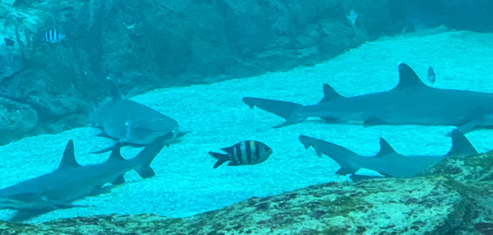

# Well Hello There!!

[](https://github.com/PlatyPew)

```
$ whoami
Daryl

$ cat aboutme
Currently a student at the Singapore Institute of Technology
Studying Information Security

$ ls interests/
🚩 CTFs  📝 Neovim  🍚 Ricing  💻 Programming

$ ls skills/
🐳 Docker  🌳 Git  🕸 Node  🐍 Python

$ cowsay < wisdom
 _____________________________ 
<  FOSS is love, FOSS is life >
 ----------------------------- 
        \   ^__^
         \  (oo)\_______
            (__)\       )\/\
                ||----w |
                ||     ||
```

### Check out some of my work

[](https://github.com/PlatyPew/dotfiles)
[](https://github.com/PlatyPew/PwnBox2)
[](https://github.com/PlatyPew/picoctf-2018-writeup)
[](https://github.com/PlatyPew/format-installer.nvim)


Fish living a life of danger.
