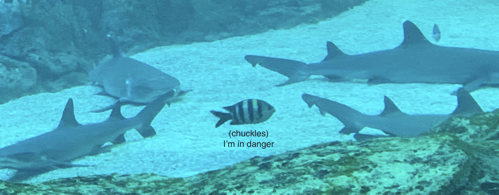

# Well Hello There!!

[](https://github.com/PlatyPew)

```
$ whoami
Daryl

$ cat aboutme
Currently a student at the Singapore Institute of Technology
Studying Information Security

$ ls interests/
🚩 CTFs  📝 Neovim  🍚 Ricing  💻 Programming

$ ls skills/
🐳 docker  🌳 git  🕸 node  🐍 python
```

### Check out some of my work
[](https://github.com/PlatyPew/dotfiles)
[](https://github.com/PlatyPew/PwnBox2)
[](https://github.com/PlatyPew/picoctf-2018-writeup)
[](https://github.com/PlatyPew/format-installer.nvim)

Nothing left to see here, so here is a fish living life dangerously.



Photo taken by me, at the S.E.A. Aquarium in Resorts World Sentosa, Singapore.
